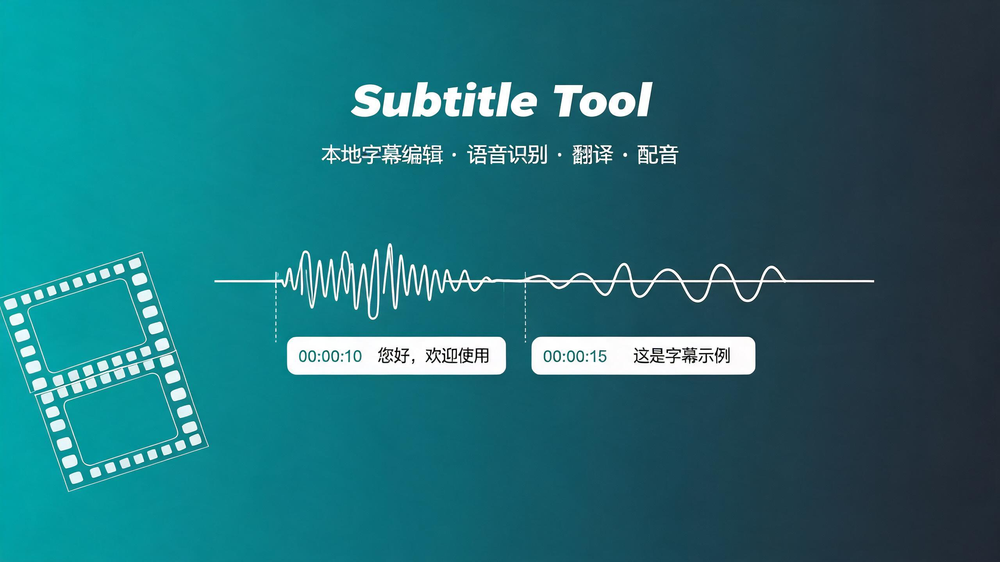

<div align="center">



# Subtitle Tool

[](https://opensource.org/licenses/MIT)
[](https://www.python.org/downloads/)
[](https://vuejs.org/)
[](https://www.electronjs.org/)

**English** | [简体中文](README.zh-CN.md)

A powerful local subtitle editing and processing tool supporting subtitle editing, speech recognition, translation, dubbing generation, and hard-subtitle embedding. Built with a **Vue 3 + Electron** desktop frontend and a **Flask** local backend — speech recognition and synthesis run entirely on your machine, your data stays local.

</div>

## Features

### Subtitle Editing
- Import, edit, and export SRT, VTT, ASS, SSA and other subtitle formats
- Undo/redo, find & replace, multi-step replacement, jump to subtitle number
- LLM-based spell checking with custom dictionaries
- Timeline overlap detection with one-click resolution, subtitle statistics panel

### Speech Recognition
- Powered by OpenAI Whisper (openai-whisper / faster-whisper / whisper.cpp / whisper-ctranslate2)
- GPU acceleration, automatic language detection, multiple models (tiny/base/small/medium/large)
- Background tasks with progress reporting, cancellation, and automatic temp-file cleanup

### Translation
- Multi-engine support: Ollama (local, no API key), DeepSeek, Alibaba Bailian (DashScope), DeepL / Google / ChatGPT / Anthropic / Gemini / Mistral / LibreTranslate
- Free-form model names for cloud engines; custom prompts with **soft video-duration constraints**
- Batch translation with async tasks

### Text-to-Speech (TTS)
- Voice-cloning engines: **Spark-TTS** and **Qwen3-TTS** (ICL high-quality / xvec_only fast modes)
- Smart timeline alignment: batch generation (batch=4), automatic silence trim/compress/pad, never changes playback speed
- Import external audio as a reference voice

### Hard Subtitles & Waveform
- Hard-subtitle embedding with custom font, size, color, outline, and position
- Video/audio waveform visualization, subtitle timeline alignment, zoom and drag

## Quick Start

### Prerequisites

- Python 3.12+ (backend)
- Node.js 18+ (frontend build)
- FFmpeg (must be on system PATH)
- _Optional_ CUDA GPU — for Whisper / TTS acceleration
- _Optional_ Ollama service — for the local translation engine

### Installation

```bash
# Option 1: install all dependencies at once (from the repo root)
npm run install:all

# Option 2: step by step
pip install -r requirements.txt          # backend Python dependencies
cd frontend && npm install               # frontend dependencies
```

> For reproducible installs, use the lockfile: `pip install -r requirements.lock.txt`.

Download TTS models (optional, only if you use TTS):

```bash
# Spark-TTS model
cd Spark-TTS
python -c "from huggingface_hub import snapshot_download; snapshot_download('SparkAudio/Spark-TTS-0.5B', local_dir='pretrained_models/Spark-TTS-0.5B')"

# Qwen3-TTS model
cd ../Qwen3-TTS
python -c "from huggingface_hub import snapshot_download; snapshot_download('Qwen/Qwen3-TTS-12Hz-1.7B-Base', local_dir='Qwen3-TTS-12Hz-1.7B-Base')"
```

### Running

Development mode (Electron desktop app + auto-started backend):

```bash
npm run dev
# or step by step:
python app.py                # terminal 1: Flask backend (http://127.0.0.1:5000)
cd frontend && npm run dev   # terminal 2: Vite dev server
cd frontend && npm run electron:dev   # terminal 3: Electron (dev mode)
```

Browser-only mode (no Electron):

```bash
python app.py
cd frontend && npm run dev
# open the Vite dev server URL in your browser
```

## Project Structure

```
subtitle_tool/
├── backend/                 # Flask backend
│   ├── config/              # Settings (port, upload limit, model dirs, ...)
│   ├── routes/              # API routes (Blueprint)
│   ├── services/            # Business logic (recognition/translation/TTS/hard-subtitle)
│   └── utils/               # Utilities (unified responses, logging, temp cleanup)
├── frontend/                # Vue 3 + Electron frontend
│   ├── src/
│   │   ├── components/      # Components (incl. modals/ feature dialogs)
│   │   ├── stores/          # Pinia state management
│   │   ├── services/        # API service wrappers
│   │   └── utils/           # Utilities (runtime/storage)
│   ├── electron/            # Electron main process and preload
│   └── tests/               # Unit tests (Vitest)
├── Spark-TTS/               # Spark-TTS engine (with pretrained models)
├── Qwen3-TTS/               # Qwen3-TTS engine
├── Release/                 # Whisper.cpp release binaries (whisper-cli, etc.)
├── Temp/                    # Runtime temp files (auto-cleaned)
├── app.py                   # Flask application entry
├── .env.example             # Environment variable example (see Configuration)
├── requirements.txt         # Python dependencies (loose lower bounds)
└── requirements.lock.txt    # Python dependencies (reproducible lock)
```

## Common Commands

```bash
npm run install:all                 # install all frontend + backend dependencies
npm run dev                         # dev mode (Electron + backend)
python app.py                       # start the Flask backend
npm run electron:build              # build and package the desktop app (electron-builder)
cd frontend && npm test             # frontend unit tests (Vitest)
cd frontend && npm run lint         # ESLint check (Vue/JS)
```

> Command sources: `scripts` fields of the root and `frontend/package.json`.

## Configuration

> A complete example of all environment variables is in [`.env.example`](.env.example) at the repo root; the table below lists the main ones.

### Backend Environment Variables

| Variable | Required | Default | Description |
|----------|----------|---------|-------------|
| `SUBTITLE_TOOL_BACKEND_PORT` | No | `5000` | Backend service port |
| `SUBTITLE_TOOL_BACKEND_DEBUG` | No | `0` | Set to `1` to enable Flask debug mode |
| `TRANSLATION_DURATION_CONSTRAINT_ENABLED` | No | `true` | Soft video-duration constraint for translation (`false`/`0` disables) |
| `DEEPSEEK_API_KEY` | No | — | DeepSeek translation engine key (can also be entered in the translation dialog) |
| `DASHSCOPE_API_KEY` / `BAILIAN_API_KEY` | No | — | Alibaba Bailian translation engine key |

### Frontend Environment Variables (`frontend/.env*`)

| Variable | Description |
|----------|-------------|
| `VITE_API_BASE_URL` | Backend API URL (dev default `http://localhost:5000`, empty in production and injected by Electron) |
| `VITE_APP_TITLE` | Application title |

### Feature Configuration (in the UI)

- **Whisper models**: tiny / base / small / medium / large
- **TTS engines**: spark-tts / qwen3-tts; Qwen3 modes: icl / xvec_only
- **Translation engines**: Ollama / DeepSeek / Alibaba Bailian, managed in Settings and the translation dialog

## API Overview

Unified response structure: `{ success, data, error_code, message }`. All endpoints are prefixed with `/api` and only accept localhost and `app://` origins.

| Module | Endpoints |
|--------|-----------|
| Speech recognition | `POST /transcribe`, `GET /transcribe/<task_id>`, `GET /transcribe/<task_id>/result`, `GET /transcribe/<task_id>/events` (SSE), `POST /transcribe/<task_id>/cancel` |
| Whisper models | `GET /whisper/list`, `GET /whisper/downloaded`, `POST /whisper/download`, `GET /whisper/status`; same structure for whisper-cpp / whisper-ctranslate2 |
| Vosk | `GET /vosk/list`, `POST /vosk/download`, `GET /vosk/status` |
| Translation | `POST /translation/async`, `GET /translation/status`, `GET /translation/result` |
| Spell check | `POST /spell-check/ai`, `POST /spell-check/suggestions`, dictionary/name CRUD |
| TTS dubbing | `GET /tts/engines`, `POST /tts/generate-subtitles`, `GET /tts/status`, `GET /tts/result`, `POST /tts/abort`, `GET /tts/download/<filename>`; voices: `GET /tts/voices`, `POST /tts/upload-voice`, `DELETE /tts/delete-voice/<filename>` |
| TTS video synthesis | `POST /tts-video/generate`, `GET /tts-video/status`, `POST /tts-video/abort`, `GET /tts-video/download` |
| Hard subtitles | `POST /hard-subtitle/generate`, `POST /hard-subtitle/generate-from-path`, `GET /hard-subtitle/status`, `POST /hard-subtitle/abort`, `GET /hard-subtitle/download` |
| Waveform | `POST /waveform/generate`, `POST /waveform/generate-from-path` |
| Video | `GET /video/serve?path=<path>` (local file serving) |
| Subtitle persistence | `POST /subtitle/save-original`, `POST /subtitle/save-translation`, `POST /subtitle/auto-save` |
| System | `GET /settings/health`, `GET /settings/version`, `GET /settings/diagnostics`, cache stats and cleanup, `POST /settings/open-directory`, `POST /settings/open-logs` |

## Testing & Quality

```bash
cd frontend && npm test    # Vitest unit tests (tests/)
cd frontend && npm run lint
```

Current unit tests cover core utilities such as subtitle format parsing/serialization (`frontend/tests/subtitle-formats.test.js`). The backend has no automated tests yet and relies on manual API integration checks.

## Packaging

```bash
cd frontend && npm run electron:build   # vite build + electron-builder
```

electron-builder config (`build` field in `frontend/package.json`): Windows NSIS installer, macOS DMG, Linux AppImage; registers the `.stproj` project file association.

## FAQ

### CUDA out of memory
- Use a smaller Whisper model; reduce batch size; or run on CPU.

### Audio generation fails
- Check that TTS models are installed correctly; make sure disk space is sufficient; check backend logs for details.

### Subtitle timeline misaligned
- Use the "split long lines" feature; adjust subtitle timing manually; when dubbing overruns, backend logs record silence borrowing and shifting.

### FFmpeg not found
- Make sure FFmpeg is installed and on your system PATH (on Windows, download from [ffmpeg.org](https://ffmpeg.org/download.html)).

## Disclaimer

- This tool is provided **as is** for personal learning and research, without warranty of any kind. See the [MIT License](LICENSE).
- Speech recognition, synthesis, and translation are powered by AI models; output may be inaccurate. **Always review generated subtitles, translations, and dubbing before use.**
- Speech recognition, TTS, and the Ollama translation engine run locally. **Cloud translation engines (DeepSeek, Bailian, DeepL, Google, ChatGPT, etc.) send your subtitle text to third-party services** — do not use them for confidential or sensitive content.
- Users are responsible for obtaining the necessary rights for the source videos, audio, and reference voices they process. Comply with the copyright laws and the terms of service of the models and APIs you use; the authors are not liable for any misuse.

## Documentation Maintenance

Update this document when:
- API routes are added or renamed (`backend/routes/`)
- Environment variables or configuration change (`backend/config/settings.py`, `frontend/.env*`)
- Backend/frontend script commands are added or removed (root and `frontend/package.json`)
- The project directory structure changes

## License

[MIT License](LICENSE)

## Acknowledgements

- [OpenAI Whisper](https://github.com/openai/whisper) · [faster-whisper](https://github.com/SYSTRAN/faster-whisper) · [whisper.cpp](https://github.com/ggerganov/whisper.cpp) — speech recognition
- [Spark-TTS](https://github.com/SparkAudio/Spark-TTS) — speech synthesis
- [Qwen3-TTS](https://github.com/QwenLM/Qwen3-TTS) — speech synthesis
- [Vue.js](https://vuejs.org/) · [Element Plus](https://element-plus.org/) · [Electron](https://www.electronjs.org/) — frontend framework
- [FFmpeg](https://ffmpeg.org/) — audio/video processing
